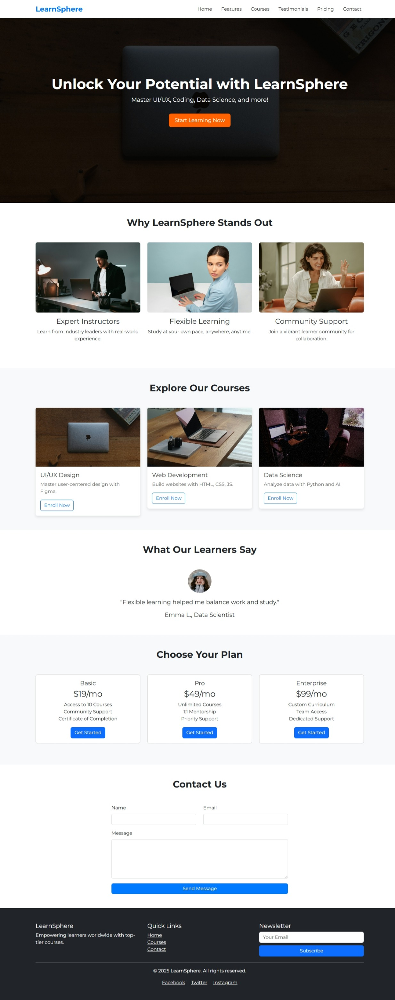
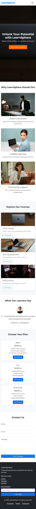

# learnsphere-landing-page
A modern, responsive landing page for an online learning platform, built with HTML, CSS, Bootstrap, and jQuery.

# LearnSphere Landing Page

## Overview
LearnSphere is a modern, responsive landing page for an online learning platform, designed to attract learners interested in UI/UX, coding, and data science courses. Built with **HTML, CSS, Bootstrap 5, JavaScript, and jQuery**, it features a professional UI, animations, and a user-friendly interface. This project showcases my ability to create pixel-perfect, interactive websites for clients on Fiverr.

## Features
- **Responsive Design**: Adapts seamlessly to desktop and mobile devices.
- **Interactive Elements**: jQuery-powered course slider, testimonial carousel, and smooth scrolling.
- **Modern UI/UX**: Consistent blue-orange color scheme, Montserrat font, and unique card designs.
- **Sections**: Header, Hero, Features, Courses, Testimonials, Pricing, Contact Form, Footer.
- **Animations**: Fade-in effects, hover transitions, and a loading spinner.
- **Bug-Free**: Clean, SEO-friendly code with cross-browser compatibility.

## Technologies Used
- **HTML5**: Semantic structure.
- **CSS3**: Custom styling with Bootstrap 5 for responsive grids.
- **JavaScript/jQuery**: Animations and interactivity.
- **Bootstrap 5**: Layout and components.
- **Unsplash**: Royalty-free images.

## Setup Instructions
1. **Clone the Repository**:
   ```bash
   git clone https://github.com/muzamal478/learnsphere-landing-page.git
   ```
2. **Navigate to Folder**:
   ```bash
   cd learnsphere-landing-page
   ```
3. **Open Locally**:
   - Open `index.html` in a browser (e.g., Chrome).
   - Or use a local server (e.g., VS Code Live Server).

## Deployment
The website is live on GitHub Pages: [View Live Demo](https://muzamal478.github.io/learnsphere-landing-page/)

## Project Structure
```
learnsphere-landing-page/
├── index.html
├── css/
│   └── style.css
├── js/
│   └── script.js
├── images/
│   ├── hero-bg.jpg
│   ├── feature1.jpg
│   ├── feature2.jpg
│   ├── feature3.jpg
│   ├── course1.jpg
│   ├── course2.jpg
│   ├── course3.jpg
│   ├── testimonial1.jpg
│   ├── testimonial2.jpg
│   └── testimonial3.jpg
└── README.md
```

## Screenshots
**Desktop View**  


**Mobile View**  


## Credits
- **Images**: Royalty-free from [Unsplash](https://unsplash.com/).
- **Fonts**: Montserrat via Google Fonts.
- **Developer**: Muzamal Asghar ([GitHub](https://github.com/muzamal478)).

## License
This project is licensed under the MIT License - see the [LICENSE](LICENSE) file for details.

## Contact
For inquiries, reach out via [Fiverr](https://www.fiverr.com/muzamilcreator) or [GitHub](https://github.com/muzamal478).
